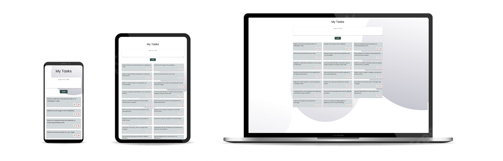

# Application My Task


## Description

### It is an application through which you can record your daily tasks and can delete or modify them



_Project link is available at_ [My Tasks](https://my-tasks-exbv.onrender.com/)

## Getting Started

1. Clone the repo
2. Add `.env` file and create `MONGODB_URL` variable and add URL to your database.
3. Install npm packages by run this command `npm install`.
4. Run the app by write this command: `node server.js`.
5. Open `http://localhost:3000` in the browser.

### project structure

```
_________
        |______controller
        |   |____my-task.js
        |
        |______public
        |   |____images
        |   |____style.css
        |   |____index.html
        |   |____index.js
        |
        |____routes
        |   |____my-task.js
        |
        |____app.js
        |____db.js
        |____package.json
        |____Readme.md
```

### javascript code description

ES6

- Arrow Functions
- Block-Scope Variables
- async await
- Modules export/import
- New Built-In Methods
